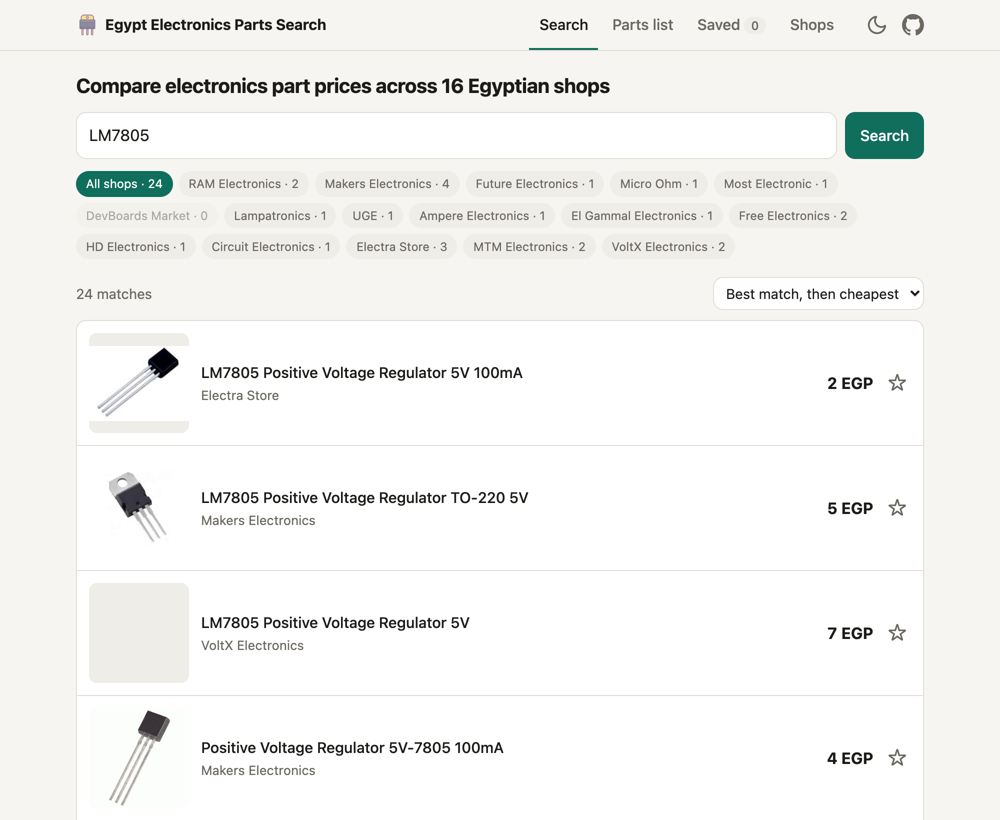
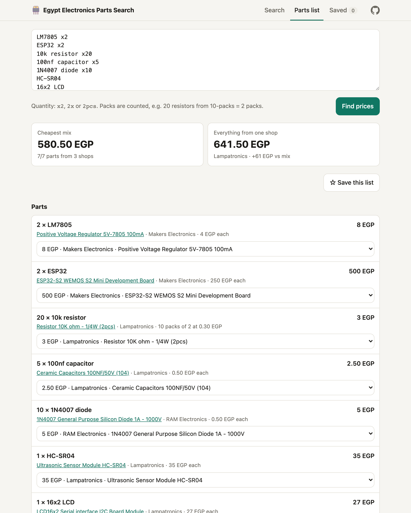

<div align="center">


# Egypt Electronics Parts Search + MCP

**One search box for Egypt's electronic-parts shops.**<br>
Find a part, see every in-stock price side by side, and price a whole parts list in seconds.

### [**→ Open the site**](https://parts.ahmedshaalan.com/)

`16 shops` · `live prices` · `out-of-stock hidden` · `works on your phone` · `free, no sign-up` · [`MCP for AI assistants`](#use-it-from-claude-or-another-ai-assistant) · [`AGPL-3.0 license`](LICENSE)



</div>

---

## Why

Buying parts in Egypt means opening RAM, Makers, Future, UGE and half a dozen other tabs, typing the same part number into each one, and hoping it's actually in stock. Every shop names the same part differently (`LM7805`, `L7805CV`, `7805 Regulator`), and their own search boxes rarely treat them as the same thing.

Egypt Electronics Parts Search asks every shop at once, recognizes those names as the same part, and gives you one clean list with in-stock items only.

## Features

**🔍 Search every shop at once**
- Queries all 16 shops at the same time; results fill in as the shops answer
- The same product at different shops is one card, cheapest first, with every shop's offer inside (or see every offer in one list)
- Hides out-of-stock items automatically, and shows sale prices and the per-piece price for packs ("(10pcs)")
- Sort by best match, cheapest, or cheapest per piece; tick shops on or off, or show only sale items or ones you can add to cart from here
- Weaker matches are kept apart, each saying why it's probably a different part
- A shop that failed, timed out or was skipped says so, and can be asked again with one click

**🤖 Ask your AI assistant**
- An [MCP server](#use-it-from-claude-or-another-ai-assistant) lets Claude or another AI assistant search the shops, price a parts list and re-check a price for you
- Runs on your own computer with the same matching as the site: no account, key or fee

**📋 Price a whole parts list**
- Type or paste parts, one per line; each joins the list and is priced at every shop as it's added. Change a quantity, a part or its product right in the row
- Choose how to buy: **Best overall** (parts plus delivery), **Lowest parts cost** or **Fewest shops**, or **Custom** once you pick a product yourself. Every row says why it's at that shop when a cheaper one exists
- Delivery counts: set a fee per shop, or one for any shop, so an extra shop is only used when it saves more than its delivery
- Counts packs: 20 resistors sold in 2-packs = 10 packs
- Every offer for a part is a click away, with its picture, shop, pack and cost for your quantity; look-alikes are kept apart and never picked for you

**🛒 Add to the shop's cart**
- Put a search result straight into its shop's cart, in a new tab that opens on the cart
- From a parts list, fill each shop's cart with what the order has there, quantities included; for shops whose cart can't be filled from here, copy the order as a message for their WhatsApp or order form
- Works at the 10 Shopify and WooCommerce shops (Future, DevBoards, Makers, Micro Ohm, Most, UGE, Ampere, Free, HD and Circuit); checkout stays on the shop's own site

**⭐ Save and track**
- Star any product to save it. **Update prices** re-checks every starred item at its shop and shows what went ▲ up, ▼ down, or out of stock, with a link to find it elsewhere
- Name and save a parts list, switch between saved lists, and reopen one later with fresh prices, or build one up from search results. It remembers the products you picked
- Saved items stay private in your own browser, with no accounts; **Back up** saves them to a file and **Restore** brings them back

**📱 Works anywhere**
- A plain website: open it on your laptop or phone, nothing to install
- Follows your system's light or dark mode

<table>
<tr>
<td width="62%"></td>
<td width="38%"></td>
</tr>
<tr>
<td align="center"><sub>Parts list: cheapest mix vs. one shop</sub></td>
<td align="center"><sub>Phone, dark mode</sub></td>
</tr>
</table>

## Using it

Open **[parts.ahmedshaalan.com](https://parts.ahmedshaalan.com/)**. On a phone, *Add to Home Screen* gives it an app icon.

### Search

Type a part number or a description: `LM7805`, `ESP32`, `10k resistor`, `HC-SR04`. Exact part numbers give the sharpest results. Press `/` from anywhere on the tab to jump to the box; your recent searches wait under it.

| You'll see | What it means |
|---|---|
| **Searching 16 shops… 9 answered** | Results show once a few shops have answered with a match, and the rest join as they answer. **Stop waiting** skips the shops still running |
| A card with **12 shops** | The same product at 12 shops: the cheapest shop and price, then the next few. Open it for every shop's offer. Only close matches are merged (the package, values like 5V, model codes like S3 or 30-pin and the pack size must agree); anything unsure has its own card. **Every offer** shows the plain list |
| The **Shops** panel | Each shop's number of matches. Untick a shop to hide it, or **Only** to see just that one. Shops still searching spin; a shop that **didn't answer** or was **skipped** has **Try again** or **Search now** |
| **Sale** | The shop is discounting it; the original price is struck through |
| `pack of 10 · 0.50 EGP each` | The listing is a pack; this is the price per piece |
| **N weaker matches** | Loosely related items, folded at the bottom, each saying why it's probably a different part: the part number missing from its name, or that it's an accessory made for it |
| Cart, ☆ and ⋯ | The cart puts it into the shop's cart in a new tab (only for [shops that allow it](#supported-shops)); ☆ saves it; ⋯ opens it, adds it to a parts list (in one click to the list you added to last) or copies it |
| **Copy link** | A link that opens these results |

### Parts list

The list is the page: type or paste parts in the **Add parts** box (<kbd>Ctrl</kbd>/<kbd>⌘</kbd> + <kbd>Enter</kbd> adds them) and each becomes a row, priced at every shop as it's added. All of these quantity formats work:

```
LM7805 x2
2x ESP32
10k resistor 20pcs
100nf capacitor, 5
- 1N4007 diode x10
- 2 Mini-360 buck converter
- 1 relay DPDT, 12 V coil (HK19F class)
HC-SR04
16x2 LCD
```

Bullets and numbering are ignored, `#` lines are treated as comments, and names like `16x2 LCD`, `16 x 2 LCD`, `12 V relay`, `4 channel relay` or `555 timer` aren't mistaken for a quantity. Lists written as a spec sheet work too: notes after a comma or in brackets are left out of the search, so the line above is searched as `relay DPDT`. A single word or value after a comma stays: `Resistor, 10k, 1/4W` is searched as `Resistor 10k 1/4W`. A part already on the list gets the quantity added. Up to 40 parts per list.

| You'll see | What it means |
|---|---|
| A row | The part, its quantity (type it or use + and −), what it costs, and the product it would be bought as, with its shop. Click the product to see every offer: sorted by the cost for your quantity, with a box to filter by name or shop, and weaker matches below a line with why they're probably a different part. Choose one to buy that instead |
| **Saves a delivery** | A cheaper offer exists at another shop, but buying this part where the rest of the order is costs less once delivery is counted |
| **Look-alike skipped** | A cheaper product was left out because it's probably a different part |
| **Check match** / **Not found** | Only weaker matches were found, so nothing is bought for it until you choose one; or no shop has it in stock |
| ⋯ | **Change part** searches for another name or changes the quantity, for that row only; if no shop has the new name, the box stays open to try another. Also opens the product at its shop, or removes the row (with **Undo**) |
| **How to buy** | **Best overall** is the lowest parts cost plus delivery; **Lowest parts cost** takes the cheapest product for each part wherever it is; **Fewest shops** means the fewest deliveries. Choosing a product yourself makes it **Custom**: the plan you were on, with your picks. The rows follow the choice, and when a change moves other parts to another shop, they light up and a message says so |
| **Delivery fees** | One estimate for any shop, and your own figure for the shops you know. They're kept in this browser and apply to every list |
| **Your order** | One basket per shop with what goes in it. **Fill cart at …** opens the shop with them in its cart, quantities set (counting packs); a Shopify shop takes them all at once, a WooCommerce shop one per link, so the tab adds them one after another and ends on the cart. Products with options to choose (a size, a colour) are added on the shop's page. For a shop whose cart can't be filled from here, open each part from the basket, or **Copy as message** for their WhatsApp or order form |
| **Prices from 15 of 16 shops** | A shop didn't answer; **Try again** asks it again for every part |

The list's name is its title. **Save** keeps it in this browser, the header says when there are unsaved changes, and **My lists** switches to another saved list, starts a new one or copies this one as text. The list on the tab is kept when the page is reloaded.

### Saved

Two tabs, **Starred items** and **Parts lists**; the page opens on the one you used last.

**Starred items** shows today's price for each item and, when it moved, how much since you starred it. **Update prices** re-checks each one directly at its shop. The filters pick out what got cheaper, pricier, or can't be bought now; an item out of stock or **No longer listed** has **Find elsewhere**, which searches every shop for it. Tick items to see what they cost together, then add them to a parts list, copy or remove them in one go. Removing has **Undo**.

**Parts lists** are cards with each list's first parts, its total and from how many shops. **Update prices** prices one list or all of them again, and each card shows how its total moved; **changed since** means parts were added after it was priced. The ⋯ menu opens, renames, duplicates, copies or deletes a list.

Opening a saved list shows it on the **Parts list** tab and prices it again. The products you chose are kept with the list and chosen again when you open it; if one is sold out or gone, its row says **Your pick is gone** and the plan chooses again. A saved list's total includes delivery, using the plan it would be bought with.

Saved items live in your browser's storage, so they're private to that browser and device. Clearing site data or using a private window removes them: **Back up** downloads them as a file, and **Restore** adds a backup's items and lists back.

## Use it from Claude or another AI assistant

The [`mcp/`](mcp/) folder is an [MCP](https://modelcontextprotocol.io) server that gives an AI assistant the same search. It runs on your own computer and asks the shops directly, so it needs no account, no key and no relay. Ask things like *"find the cheapest LM7805"* or *"price this parts list"* and paste the list. The site's [**AI** tab](https://parts.ahmedshaalan.com/#ai) walks through the same setup step by step.

```sh
cd mcp && npm install
claude mcp add --scope user egypt-parts -- node "$PWD/server.js"   # Claude Code
```

For Claude Desktop or another client, add it to the client's MCP config:

```json
{ "mcpServers": { "egypt-parts": { "command": "node", "args": ["/full/path/to/mcp/server.js"] } } }
```

| Tool | What it does |
|---|---|
| `search_parts` | Searches every shop for one part: in-stock products, best match first, then cheapest. Can narrow to some shops and include weak matches. |
| `price_parts_list` | Prices a parts list: the pick per line, the cheapest mix, the cheapest single shop, and what each shop is missing. |
| `check_price` | Re-checks one product's price and stock at its shop. |
| `list_shops` | The shops and the keys the other tools take. |

It runs the site's own code from `src/js`, so it matches and totals exactly like the site. Needs Node 20 or newer. Searches are cached for an hour while the server runs. Without the relay's shared cache, a shop may briefly rate-limit your connection if you search a lot, and it then shows as failed.

## Supported shops

| Shop | Platform | How it's searched | Add to cart |
|---|---|---|---|
| [RAM Electronics](https://www.ram-e-shop.com) | Odoo | Search results page, plus a stock lookup per product | — |
| [Makers Electronics](https://makerselectronics.com) | WooCommerce | Store API | ✓ |
| [Future Electronics](https://store.fut-electronics.com) | Shopify | Full catalog, searched in the browser | ✓ |
| [Micro Ohm](https://microohm-eg.com) | WooCommerce | Store API | ✓ |
| [Most Electronic](https://mostelectronic.com) | WooCommerce | Store API | ✓ |
| [DevBoards Market](https://devboardsmarket.com) | Shopify | Full catalog, searched in the browser | ✓ |
| [Lampatronics](https://lampatronics.com) | Custom (Laravel + Vue) | The site's own product API | — |
| [UGE](https://uge-one.com) | WooCommerce | Store API | ✓ |
| [Ampere Electronics](https://ampere-electronics.com) | WooCommerce | Store API | ✓ |
| [El Gammal Electronics](https://el-gammal.com) | Supabase (Lovable) | The shop's public database API, plus a stock lookup per product | — |
| [Free Electronics](https://free-electronic.com) | WooCommerce | Store API | ✓ |
| [HD Electronics](https://hdelectronicseg.com) | WooCommerce | Store API | ✓ |
| [Circuit Electronics](https://circuit-electronics.com) | WooCommerce | Store API | ✓ |
| [Electra Store](https://electra.store) | Custom (Laravel) | Full catalog from the shop's API, searched in the browser, plus a stock lookup per product | — |
| [MTM Electronics](https://mtm-electronic.com) | Custom (Next.js + Laravel) | Full catalog from the shop's API, searched in the browser | — |
| [VoltX Electronics](https://voltx-store.com) | Custom (Next.js) | The shop's own public search API | — |

**Add to cart** needs a shop whose cart a link can fill. The others only add to their cart from their own page (behind a security token, or with the cart kept in the browser), so for them the product link opens the page and the shop's own button is one click away.

## How it works

The whole app runs in your browser. It's a static site on GitHub Pages, with no server of its own.

The catch: browsers only let a website read another site's data if that site allows it (CORS). The two Shopify shops, El Gammal, MTM, VoltX and Electra's catalog do; the other ten don't. For those, requests go through a tiny **relay** on Cloudflare Workers that fetches the shop's page and hands it back.

```
                                ┌──────────── direct ────────────► Future, DevBoards, El Gammal,
 GitHub Pages site ─────────────┤                                  MTM, VoltX, Electra's catalog  (CORS allowed)
 (all search logic, in JS)      └─► Cloudflare Worker relay ─────► RAM, Makers, Micro Ohm, Most,
                                    (allow-listed shops only,      UGE, Ampere, Lampatronics,
                                     1-hour cache)                 Free, HD, Circuit, Electra's stock
```

1. **Fan out.** A search runs against all shops in parallel, and the results show as they come in: once three shops have answered with a match, then each shop as it answers. Each shop gets 25 seconds; a slow or broken shop is marked failed instead of holding up the rest. You can also stop waiting early: the shops still running are marked skipped, and each can be fetched on its own afterwards.
2. **Widen the net.** Shop search engines match text literally, and WooCommerce matches several words as one phrase, so the app also sends variants: `12 V 2 A` → `12v 2a`, `Mini-360 buck converter` → `mini360`, `XKC-Y25-NPN level sensor` → `xkc-y25`, `power supply with barrel jack` → `power supply`, `LM7805` → `7805`, `16x2 LCD` → `1602 LCD`. Variants only widen what the shops return; scoring still decides what matches.
3. **Score.** Every product name is scored 0–100 against your query (see below). Scores of 70+ are shown as matches, 45–69 as weaker matches, and anything lower is dropped.
4. **Filter and sort.** Out-of-stock and zero-price items are removed, and results are sorted by score, then price.
5. **Cache.** Results are kept for an hour (2 minutes if any shop failed). A search with skipped shops isn't cached until every skipped shop has been fetched, so searching again asks all of them. The relay also caches shop responses for an hour, shared across everyone who uses the site, so a price can be up to about two hours old. Starting a new search stops the one it replaces.

### The relay

[`worker/src/index.js`](worker/src/index.js) is about 140 lines and deliberately dumb: all parsing and matching happen in the browser. It:

- only fetches from the shop domains it knows, redirects included, so it can't be used as an open proxy
- only answers requests from the site's own origin (plus `localhost` for development)
- forwards just three headers (`x-api-key`, `content-type`, `accept`) and caps request bodies
- caches successful shop responses for an hour at Cloudflare's edge; errors aren't cached
- can return just the first bytes of a response (`bytes=`), so a stock check on a 350 KB product page sends the browser 24 KB

### Matching

Matching is what makes the results trustworthy, so it gets its own module ([`src/js/matching.js`](src/js/matching.js)):

| Rule | Example |
|---|---|
| Part numbers match their core | `LM7805` matches `L7805CV` |
| Values and part numbers must match | `10k resistor` does **not** match `910K` or `110 KOHM`, and `4.7k` doesn't match `47K` |
| Words match whole | `male header` doesn't match "Female Header" |
| Plurals and suffixes match | `resistor` matches `Resistors`; `esp32` matches `ESP32-S3` |
| Units and symbols are normalized | `Ω` → `ohm`, `µ` → `u`, `×` → `x` |
| Values keep their units | `12 V` is `12v`, `250 mA` is `0.25A` and `220.0 ohm` is `220 ohm`, so `3.3V regulator` doesn't match a 3.3 ohm resistor, and `fuse 250mA` doesn't match a 2A 250V fuse |
| Makers' names are optional | `Omron Power Relay G2R-2 12VDC` matches `RELAY G2R-2-12VDC`; a name without the maker isn't counted as a worse match |
| Common aliases | `16x2` ↔ `1602`, `20x4` ↔ `2004`, `12864` → `128x64` |
| Accessories rank lower | "Acrylic case **for** Arduino UNO" is a weaker match for `Arduino UNO`, and "ESP32 **breakout** board" scores below the ESP32 itself, unless the search is for the accessory: `fuse holder T5x20` matches "Fuse Holder on PCB **for** T5x20" |
| Pack sizes are detected | "(10pcs)", "Pack of 5", "20 Pieces"; a kit ("Resistor Kit 600pcs") counts as one |

In a parts list, the default pick for each line is the **cheapest product within 25 points of that line's best match**. That keeps `L7805CV` as an option for `LM7805`, but stops a cheap accessory from winning on price. Shop totals use the same rule, so the "cheapest mix" and "one shop" figures are always comparable.

### Per-shop details

- **WooCommerce:** `GET /wp-json/wc/store/v1/products?search=…&stock_status[]=instock`, up to 60 results per query. Prices arrive in piasters and are converted to EGP.
- **Shopify:** the suggest endpoint caps at 10 results, so the app loads the whole catalog from `products.json` (about 1,300 products, under 1 MB compressed), keeps it for an hour, and searches it locally. Loading starts as soon as you start typing a search or a list, so the first search is fast.
- **Odoo (RAM):** parses up to 3 pages of `/shop?search=…`, then calls `get_combination_info` per product for the stock count. RAM slows down under load, so it gets at most 5 requests at a time, and stock lookups are cached for an hour.
- **El Gammal (Supabase):** the storefront reads products straight from its Supabase database with a public, read-only "anon" key, and so does this app: the same product filters as the shop's own search page, then the shop's `get_online_stock` function per matching product (at most 6 at a time, cached for an hour). The internal code at the start of product names ("XX629-") is dropped. If the shop ever changes that key, it shows as `failed` until the key in `src/js/shops.js` is updated.
- **Electra:** the store's own search only matches exact-case substrings, so the app downloads its catalog from `/api/v1/products` (about 5,300 products in 6 pages, allowed directly), keeps it for an hour and searches it locally. The API's stock count means nothing, so the product pages of the 20 best matches are read for their schema.org offer (price and availability), through the relay, which sends back only the page's first 24 KB. Offers are cached for an hour.
- **MTM:** the backend hands out the whole catalog in one request (`/backend/public/api/products`, about 3 MB, allowed directly), so the app keeps it for an hour and searches it locally. Products without a price are left out.
- **VoltX:** the storefront's own search API (`/api/products/search/public`) returns name, price, offer and stock in one response and allows browsers directly, so a search is a single request with no relay.
- **Lampatronics:** the storefront is a JavaScript app backed by `/api/frontend/product`. The API requires the key the site embeds in every page. The app reads that key from the home page and re-reads it if it's ever rejected. Up to 3 pages of 50 results.

## Project structure

```
Egypt-Electronics-Parts-Search/
├── src/                    The website, built by Vite and published to GitHub Pages
│   ├── index.html          The page's markup
│   ├── css/site.css        Styles, light and dark
│   ├── css/search.css      The Search tab's styles
│   ├── css/saved.css       The Saved tab's styles
│   ├── css/list.css        The Parts list tab's styles
│   ├── public/             Copied as they are
│   │   ├── icon.png        App icon (Icons8)
│   │   ├── og-image.png    Link preview image
│   │   ├── robots.txt, sitemap.xml
│   │   ├── CNAME           The custom domain for GitHub Pages
│   │   └── google….html    Google Search Console verification
│   └── js/                 config, shops, matching and search are shared with mcp/, so they stay plain JS
│       ├── config.js       Relay URL, timeouts, cache times
│       ├── shops.js        One connector per platform + the SHOPS list
│       ├── matching.js     Query ↔ product-name scoring, aliases, pack sizes, why a match is weak
│       ├── grouping.js     Which results are the same product at different shops
│       ├── plans.js        Ways to buy a parts list: which product and shop for each part, delivery counted
│       ├── search.js       Fan-out search, parts lists, saved items
│       ├── main.js         The page: tabs, start-up
│       └── ui/             The page's parts, one file each
│           ├── search-tab.jsx, list-tab.jsx, saved-tab.jsx, shops-tab.jsx  The tabs, in Preact
│           ├── saved.js    What's saved, for the star, the count and the Saved tab
│           ├── cart.js, add-to-list.js, copy.js
│           └── common.js   Helpers they share
├── mcp/                    MCP server for AI assistants (Node, reuses src/js)
│   └── server.js
├── worker/                 Cloudflare Worker relay
│   ├── src/index.js
│   └── wrangler.toml       Worker name and allowed origins
├── package.json            The site's build: Vite + Preact
├── vite.config.js
├── .github/
│   ├── workflows/pages.yml Builds and publishes the site on every push to main
│   └── screenshots/        Images for this README
├── CHANGELOG.md            What changed, by date
└── LICENSE                 GNU AGPL v3
```

## Run your own copy

Everything fits in the free tiers of GitHub Pages and Cloudflare Workers (100,000 relay requests a day).

**1. Fork this repo.**

**2. Deploy the relay.** You need [Node.js](https://nodejs.org) and a free [Cloudflare](https://dash.cloudflare.com/sign-up) account.

Set `ALLOWED_ORIGINS` in [`worker/wrangler.toml`](worker/wrangler.toml) to your GitHub Pages origin, e.g. `https://yourname.github.io` (just the origin, no path). Then:

```sh
cd worker
npx wrangler login
npx wrangler deploy
```

Wrangler prints the relay's address, like `https://egypt-parts-relay.yourname.workers.dev`.

**3. Point the site at it.** Put that address in `PRODUCTION_RELAY` in [`src/js/config.js`](src/js/config.js). Also point the GitHub icon link in `src/index.html` at your fork: under the AGPL, visitors to your copy must be able to get its source. Replace `parts.ahmedshaalan.com` with your own address in `src/index.html` (the canonical link, the `og:` and `twitter:` tags and the structured data), `src/public/sitemap.xml` and `src/public/robots.txt`, and delete `src/public/CNAME` and the Google verification file unless you use your own. Then commit and push.

**4. Turn on GitHub Pages.** In your fork: **Settings → Pages → Build and deployment**, set **Source** to **GitHub Actions**. The included workflow ([`.github/workflows/pages.yml`](.github/workflows/pages.yml)) builds the site and publishes it on every push to `main` that touches it. Run it once from the **Actions** tab (or push a change) and the site appears at `https://yourname.github.io/<repo-name>/` about a minute later.

## Local development

Needs Node 22 or newer. Run the relay and the site side by side:

```sh
# terminal 1: the relay on http://localhost:8787
cd worker && npx wrangler dev --var ALLOW_LOCALHOST:true

# terminal 2: the site on http://localhost:8766, reloading as you edit
npm install
npm run dev
```

Open <http://localhost:8766>. To check what GitHub Pages will get, `npm run build` puts it in `dist/` and `npm run preview` serves that. On `localhost`, the site automatically uses the local relay.

## Adding a shop

**If the shop runs WooCommerce, Shopify or Odoo**, add one line to `SHOPS` at the bottom of [`src/js/shops.js`](src/js/shops.js):

```js
new WooShop("newshop", "New Shop", "https://newshop.com"),
```

WooCommerce and Odoo shops are always fetched through the relay, so also add the hostname to `SHOP_HOSTS` in [`worker/src/index.js`](worker/src/index.js) and redeploy the relay. Shopify shops allow browsers directly and don't need it.

To check a WooCommerce shop first, this should return JSON:

```sh
curl "https://newshop.com/wp-json/wc/store/v1/products?search=7805&per_page=3"
```

For Shopify, try `https://newshop.com/products.json?limit=1`.

**If it's a different platform**, look for a JSON API behind the shop's own search box first (the browser's network tab shows it; VoltX and Lampatronics were added that way). Then extend `Shop` and implement two methods:

```js
class MyShop extends Shop {
  // Products for a query: { shop, ref, name, price, url, image, in_stock, old_price }.
  // Mark stock accurately; out-of-stock items are filtered out.
  async search(query, signal) {}

  // Current { price, in_stock } for a saved product (by the ref you set), or null if it's gone.
  async check(ref, signal) {}
}
```

`ref` is any string your connector can use to look the product up again, such as an ID, slug or handle.

## Configuration

| Setting | Where | Default |
|---|---|---|
| Relay address | `PRODUCTION_RELAY` in `src/js/config.js` | the deployed Worker |
| Time allowed per shop | `SHOP_TIMEOUT_MS` in `src/js/config.js` | 25 s |
| Search cache | `CACHE_MS` / `PARTIAL_CACHE_MS` in `src/js/config.js` | 1 h / 2 min |
| Max lines in a parts list | `MAX_LIST_LINES` in `src/js/config.js` | 40 |
| Match thresholds | `STRONG` / `WEAK` in `src/js/matching.js` | 70 / 45 |
| Aliases | `ALIASES` in `src/js/matching.js` | 16x2 ↔ 1602, … |
| Sites allowed to use the relay | `ALLOWED_ORIGINS` in `worker/wrangler.toml` | parts.ahmedshaalan.com and the GitHub Pages origin |
| Allow `localhost` too | `ALLOW_LOCALHOST` in `worker/wrangler.toml` | off (turned on by `wrangler dev --var ALLOW_LOCALHOST:true`) |
| Relay cache | `CACHE_SECONDS` in `worker/src/index.js` | 1 h |

## Privacy

- **No accounts, no cookies.** Saved items and lists stay in your own browser.
- **Anonymous visit counts.** The site uses [Cloudflare Web Analytics](https://www.cloudflare.com/web-analytics/), which counts page views without cookies or tracking individual visitors. What you search for isn't sent to it.
- **Carts are the shops' own.** Add to cart opens the shop's site, which keeps the cart (and its own cookies) the way it does when you shop there directly.
- **Searches go to the shops.** To get prices, your browser asks each shop directly, or through the relay for shops that need it. The relay's code doesn't store or log requests.

## Limitations

- **Matching is heuristic.** It handles part numbers well. Vague names like "LCD" or "sensor" need a glance at the pick, and some accessories still slip through as a strong match (for example, an I2C adapter board for `16x2 LCD`). Every parts-list row opens its offers for exactly this.
- **Delivery fees are your estimates.** The parts list counts the fees you set; shops don't publish them in a form the site can read, and a fee can depend on where you are and how much you order. Search results don't include delivery.
- **Add to cart works at 10 of the 16 shops**, and not for products with options to choose. Some products are only sold in multiples ("order in tens"); the cart then gets the next amount the shop accepts. Prices in the cart are the shop's current ones, which may have changed since the search.
- **Shops change.** A site redesign or platform switch can break its connector. The shop then shows as `failed` rather than returning wrong data.
- **A shop may block the relay.** Shops can refuse requests coming from Cloudflare's servers; that shop then shows as `failed`.
- **Only shops with a real online store are covered.** Shops that sell only through Facebook or WhatsApp can't be searched.
- **Saved items don't sync** between browsers or devices.

## Being a good citizen

This app reads the same public product data your browser does when you shop, and is built to go easy on the shops:

- The relay caches every shop response for an hour, shared by all visitors
- The catalogs searched in the browser (the Shopify shops, Electra and MTM) are fetched at most once an hour per visitor, and only once they start typing
- Starting a new search stops the requests of the one it replaces
- A parts list searches at most 4 parts at a time, and RAM, the slowest shop, gets at most 5 requests at once
- Saved-item refreshes check at most 6 items at a time
- The MCP server keeps the same limits and caches, per computer it runs on

If you run your own copy, please don't lower the cache times or raise the parallelism.

## Tech

JavaScript (ES modules) · [Preact](https://preactjs.com) · [Vite](https://vite.dev) · [GitHub Pages](https://pages.github.com) · [Cloudflare Workers](https://workers.cloudflare.com)

The search code in `src/js` (connectors, matching, totals) has no dependencies and runs unchanged in the browser and in the MCP server. The page is moving to Preact components one tab at a time.

## Changelog

What changed and when is in [CHANGELOG.md](CHANGELOG.md). Each version there is a git tag, so a copy of the MCP server can be kept on a known version (`git checkout v1.8.0`) or updated with `git pull`.

## Feedback

Found a bug, a shop that stopped working, or a shop that should be added? [Open an issue](https://github.com/AhmedShaalan/Egypt-Electronics-Parts-Search/issues).

## Credits

App icon: [Transistor](https://icons8.com/icon/set/transistor/color) icon by [Icons8](https://icons8.com).

## License

Copyright © 2026 [Ahmed Shaalan](https://ahmedshaalan.com)

Licensed under the [GNU Affero General Public License v3.0 or later](LICENSE) (AGPL-3.0-or-later). In short:

- You can use, study, modify and share this project.
- If you share a modified version, **or run one as a website or service that others use**, you must release your full source code under the same license and keep the copyright notices.
- It comes with no warranty.

Versions published before this license change were released under the MIT License.

Shop names and product data belong to their respective shops. This project isn't affiliated with any of them.
