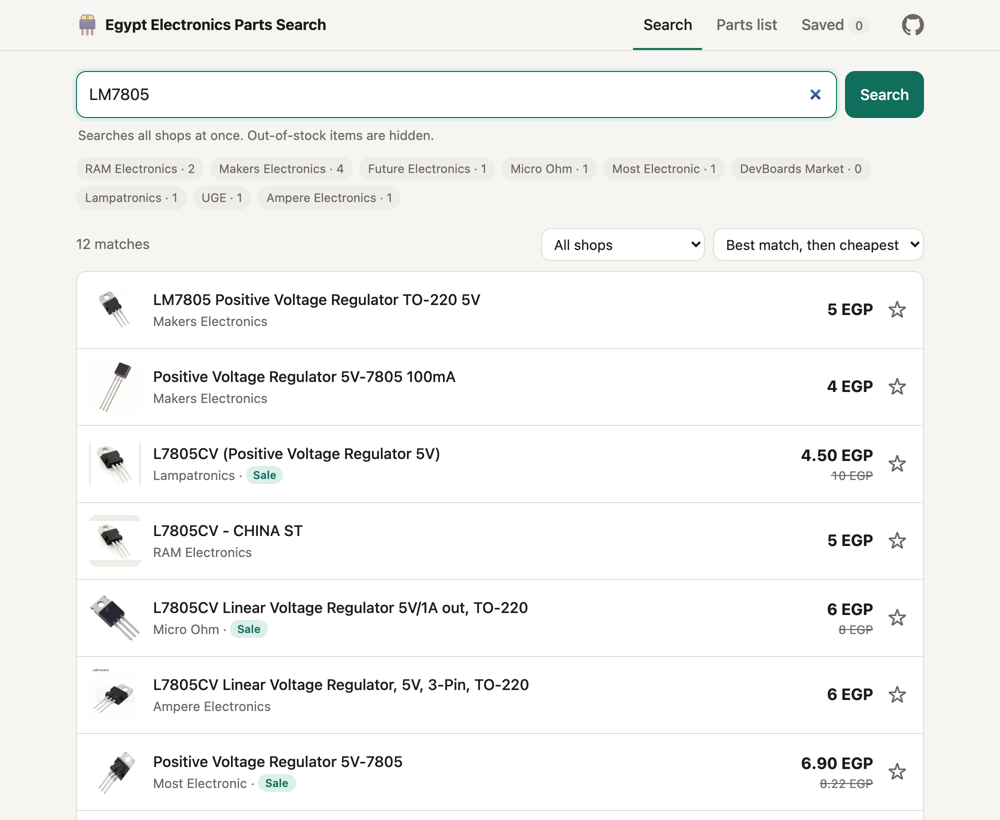
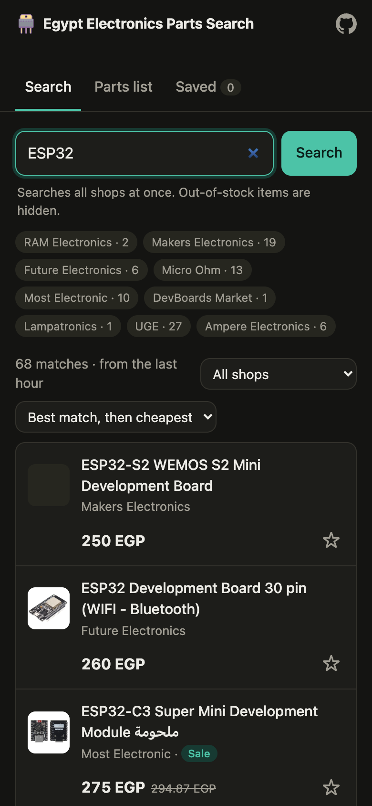

<div align="center">


# Egypt Electronics Parts Search

**One search box for Egypt's electronic-parts shops.**<br>
Find a part, see every in-stock price side by side, and price a whole parts list in seconds.

### [**→ Open the site**](https://ahmedshaalan.github.io/Egypt-Electronics-Parts-Search/)

`9 shops` · `live prices` · `out-of-stock hidden` · `works on your phone` · `free, no sign-up` · [`MIT license`](LICENSE)



</div>

---

## Why

Buying parts in Egypt means opening RAM, Makers, Future, UGE and half a dozen other tabs, typing the same part number into each one, and hoping it's actually in stock. Every shop names the same part differently (`LM7805`, `L7805CV`, `7805 Regulator`), and their own search boxes rarely treat them as the same thing.

Egypt Electronics Parts Search asks every shop at once, recognizes those names as the same part, and gives you one clean list with in-stock items only.

## Features

**🔍 Search every shop at once**
- Queries all 9 shops at the same time and merges the results into one list
- Hides out-of-stock items automatically
- Shows sale prices next to the original price, and the per-piece price for packs ("(10pcs)")
- Sort by best match, cheapest, or cheapest per piece, or filter to one shop
- Shows a label for any shop that failed or timed out, so a quiet shop is never mistaken for "not available"

**📋 Price a whole parts list**
- Paste a parts list, one part per line, and get the **cheapest mix** across shops and the **best single shop** to buy everything from
- A table of each shop's total and exactly which parts it's missing
- Counts packs: 20 resistors sold in 2-packs = 10 packs
- If the tool picked the wrong product for a line, choose another from its dropdown and the totals recalculate

**⭐ Save and track**
- Star any product to save it. **Refresh prices** re-checks every saved item at its shop and shows what went ▲ up, ▼ down, or out of stock
- Save a parts list and reopen it later with fresh prices
- Saved items stay private in your own browser. There are no accounts

**📱 Works anywhere**
- A plain website: open it on your laptop or phone, nothing to install
- Follows your system's light or dark mode

<table>
<tr>
<td width="62%"></td>
<td width="38%"></td>
</tr>
<tr>
<td align="center"><sub>Parts list: cheapest mix vs. one shop</sub></td>
<td align="center"><sub>Phone, dark mode</sub></td>
</tr>
</table>

## Using it

Open **[ahmedshaalan.github.io/Egypt-Electronics-Parts-Search](https://ahmedshaalan.github.io/Egypt-Electronics-Parts-Search/)**. On a phone, *Add to Home Screen* gives it an app icon.

### Search

Type a part number or a description: `LM7805`, `ESP32`, `10k resistor`, `HC-SR04`. Exact part numbers give the sharpest results.

| You'll see | What it means |
|---|---|
| `UGE · 27` | UGE returned 27 matching in-stock products |
| `UGE · failed` (red) | That shop didn't answer. Hover for the reason. It's retried after 2 minutes, not an hour |
| **Sale** | The shop is discounting it; the original price is struck through |
| `0.50 EGP/pc` | The listing is a pack; this is the price per piece |
| **Show N weaker matches** | Loosely related items (e.g. "PCB for ESP32"), kept out of the main list |

### Parts list

Paste one part per line. All of these quantity formats work:

```
LM7805 x2
2x ESP32
10k resistor 20pcs
100nf capacitor, 5
- 1N4007 diode x10
HC-SR04
16x2 LCD
```

Bullets and numbering are ignored, `#` lines are treated as comments, and names like `16x2 LCD` aren't mistaken for a quantity. Up to 40 lines per list.

- **Cheapest mix:** for each part, the cheapest close match from any shop.
- **Everything from one shop:** the cheapest shop that has every part, and how much more it costs than the mix. Buying from one shop usually saves on shipping, which isn't included in either total.
- **Total by shop:** every shop's total, with the parts it's missing.

### Saved

Items and lists you've starred. **Refresh prices** re-checks each saved item directly at its shop. Items that disappeared are marked **No longer listed**.

Saved items live in your browser's storage, so they're private to that browser and device. Clearing site data or using a private window removes them.

## Supported shops

| Shop | Platform | How it's searched |
|---|---|---|
| [RAM Electronics](https://www.ram-e-shop.com) | Odoo | Search results page, plus a stock lookup per product |
| [Makers Electronics](https://makerselectronics.com) | WooCommerce | Store API |
| [Future Electronics](https://store.fut-electronics.com) | Shopify | Full catalog, searched in the browser |
| [Micro Ohm](https://microohm-eg.com) | WooCommerce | Store API |
| [Most Electronic](https://mostelectronic.com) | WooCommerce | Store API |
| [DevBoards Market](https://devboardsmarket.com) | Shopify | Full catalog, searched in the browser |
| [Lampatronics](https://lampatronics.com) | Custom (Laravel + Vue) | The site's own product API |
| [UGE](https://uge-one.com) | WooCommerce | Store API |
| [Ampere Electronics](https://ampere-electronics.com) | WooCommerce | Store API |

## How it works

The whole app runs in your browser. It's a static site on GitHub Pages, with no server of its own.

The catch: browsers only let a website read another site's data if that site allows it (CORS). The two Shopify shops do; the other seven don't. For those, requests go through a tiny **relay** on Cloudflare Workers that fetches the shop's page and hands it back.

```
                                ┌──────────── direct ────────────► Future, DevBoards  (Shopify, CORS allowed)
 GitHub Pages site ─────────────┤
 (all search logic, in JS)      └─► Cloudflare Worker relay ─────► RAM, Makers, Micro Ohm, Most,
                                    (allow-listed shops only,      UGE, Ampere, Lampatronics
                                     1-hour cache)
```

1. **Fan out.** A search runs against all shops in parallel. Each shop gets 25 seconds; a slow or broken shop is marked failed instead of holding up the rest.
2. **Widen the net.** Shop search engines match text literally, so the app also sends variants: `LM7805` → `7805`, `16x2 LCD` → `1602 LCD` and `16×2 LCD`.
3. **Score.** Every product name is scored 0–100 against your query (see below). Scores of 70+ are shown as matches, 45–69 as weaker matches, and anything lower is dropped.
4. **Filter and sort.** Out-of-stock and zero-price items are removed, and results are sorted by score, then price.
5. **Cache.** Results are kept for an hour (2 minutes if any shop failed). The relay also caches shop responses for an hour, shared across everyone who uses the site.

### The relay

[`worker/src/index.js`](worker/src/index.js) is about 100 lines and deliberately dumb: all parsing and matching happen in the browser. It:

- only fetches from the 9 shop domains, so it can't be used as an open proxy
- only answers requests from the site's own origin (plus `localhost` for development)
- forwards just three headers (`x-api-key`, `content-type`, `accept`) and caps request bodies
- caches successful shop responses for an hour at Cloudflare's edge

### Matching

Matching is what makes the results trustworthy, so it gets its own module ([`docs/js/matching.js`](docs/js/matching.js)):

| Rule | Example |
|---|---|
| Part numbers match their core | `LM7805` matches `L7805CV` |
| Values and part numbers must match | `10k resistor` does **not** match `910K` or `110 KOHM` |
| Plurals and suffixes match | `resistor` matches `Resistors`; `esp32` matches `ESP32-S3` |
| Units and symbols are normalized | `Ω` → `ohm`, `µ` → `u`, `×` → `x` |
| Common aliases | `16x2` ↔ `1602`, `20x4` ↔ `2004`, `12864` → `128x64` |
| Accessories rank lower | "Acrylic case **for** Arduino UNO" and "ESP32 **breakout**" score well below the board itself |
| Pack sizes are detected | "(10pcs)", "Pack of 5", "20 Pieces" |

In a parts list, the default pick for each line is the **cheapest product within 25 points of that line's best match**. That keeps `L7805CV` as an option for `LM7805`, but stops a cheap accessory from winning on price. Shop totals use the same rule, so the "cheapest mix" and "one shop" figures are always comparable.

### Per-shop details

- **WooCommerce:** `GET /wp-json/wc/store/v1/products?search=…&stock_status[]=instock`, up to 60 results per query. Prices arrive in piasters and are converted to EGP.
- **Shopify:** the suggest endpoint caps at 10 results, so the app loads the whole catalog from `products.json` (about 1,300 products, under 1 MB compressed), keeps it for an hour, and searches it locally. Loading starts as soon as the page opens, so the first search is fast.
- **Odoo (RAM):** parses up to 3 pages of `/shop?search=…`, then calls `get_combination_info` per product for the stock count. RAM slows down under load, so it gets at most 5 requests at a time, and stock lookups are cached for an hour.
- **Lampatronics:** the storefront is a JavaScript app backed by `/api/frontend/product`. The API requires the key the site embeds in every page. The app reads that key from the home page and re-reads it if it's ever rejected. Up to 3 pages of 50 results.

## Project structure

```
Egypt-Electronics-Parts-Search/
├── docs/                   The website (served by GitHub Pages)
│   ├── index.html          UI: vanilla HTML/CSS/JS, no build step
│   ├── icon.png            App icon (Icons8)
│   ├── js/
│   │   ├── config.js       Relay URL, timeouts, cache times
│   │   ├── shops.js        One connector per platform + the SHOPS list
│   │   ├── matching.js     Query ↔ product-name scoring, aliases, pack sizes
│   │   └── search.js       Fan-out search, parts lists, saved items
│   └── screenshots/        Images for this README
├── worker/                 Cloudflare Worker relay
│   ├── src/index.js
│   └── wrangler.toml       Worker name and allowed origins
└── LICENSE                 MIT
```

## Run your own copy

Everything fits in the free tiers of GitHub Pages and Cloudflare Workers (100,000 relay requests a day).

**1. Fork this repo.**

**2. Deploy the relay.** You need [Node.js](https://nodejs.org) and a free [Cloudflare](https://dash.cloudflare.com/sign-up) account.

Set `ALLOWED_ORIGINS` in [`worker/wrangler.toml`](worker/wrangler.toml) to your GitHub Pages origin, e.g. `https://yourname.github.io` (just the origin, no path). Then:

```sh
cd worker
npx wrangler login
npx wrangler deploy
```

Wrangler prints the relay's address, like `https://egypt-parts-relay.yourname.workers.dev`.

**3. Point the site at it.** Put that address in `PRODUCTION_RELAY` in [`docs/js/config.js`](docs/js/config.js), then commit and push.

**4. Turn on GitHub Pages.** In your fork: **Settings → Pages → Build and deployment**, choose **Deploy from a branch**, branch `main`, folder **`/docs`**. The site appears at `https://yourname.github.io/<repo-name>/` within a minute or two.

## Local development

No build step. Run the relay and a static file server side by side:

```sh
# terminal 1: the relay on http://localhost:8787
cd worker && npx wrangler dev

# terminal 2: the site on http://localhost:8766
python3 -m http.server 8766 -d docs
```

Open <http://localhost:8766>. On `localhost`, the site automatically uses the local relay.

## Adding a shop

**If the shop runs WooCommerce, Shopify or Odoo**, add one line to `SHOPS` at the bottom of [`docs/js/shops.js`](docs/js/shops.js):

```js
new WooShop("newshop", "New Shop", "https://newshop.com"),
```

If the shop doesn't allow browsers to read its data (most don't), also add its hostname to `SHOP_HOSTS` in [`worker/src/index.js`](worker/src/index.js) and redeploy the relay.

To check a WooCommerce shop first, this should return JSON:

```sh
curl "https://newshop.com/wp-json/wc/store/v1/products?search=7805&per_page=3"
```

For Shopify, try `https://newshop.com/products.json?limit=1`.

**If it's a different platform**, extend `Shop` and implement two methods:

```js
class MyShop extends Shop {
  // Products for a query: { shop, ref, name, price, url, image, in_stock, old_price }.
  // Mark stock accurately; out-of-stock items are filtered out.
  async search(query, signal) {}

  // Current { price, in_stock } for a saved product (by the ref you set), or null if it's gone.
  async check(ref, signal) {}
}
```

`ref` is any string your connector can use to look the product up again, such as an ID, slug or handle.

## Configuration

| Setting | Where | Default |
|---|---|---|
| Relay address | `PRODUCTION_RELAY` in `docs/js/config.js` | the deployed Worker |
| Time allowed per shop | `SHOP_TIMEOUT_MS` in `docs/js/config.js` | 25 s |
| Search cache | `CACHE_MS` / `PARTIAL_CACHE_MS` in `docs/js/config.js` | 1 h / 2 min |
| Max lines in a parts list | `MAX_LIST_LINES` in `docs/js/config.js` | 40 |
| Match thresholds | `STRONG` / `WEAK` in `docs/js/matching.js` | 70 / 45 |
| Aliases | `ALIASES` in `docs/js/matching.js` | 16x2 ↔ 1602, … |
| Sites allowed to use the relay | `ALLOWED_ORIGINS` in `worker/wrangler.toml` | the GitHub Pages origin |
| Relay cache | `CACHE_SECONDS` in `worker/src/index.js` | 1 h |

## Limitations

- **Matching is heuristic.** It handles part numbers well. Vague names like "LCD" or "sensor" need a glance at the pick, and some accessories still slip through as a strong match (for example, an I2C adapter board for `16x2 LCD`). The dropdown on each parts-list line is there for exactly this.
- **Shipping isn't included** in any total.
- **Shops change.** A site redesign or platform switch can break its connector. The shop then shows as `failed` rather than returning wrong data.
- **A shop may block the relay.** Shops can refuse requests coming from Cloudflare's servers; that shop then shows as `failed`.
- **Makers Electronics blocks its product images** on other sites, so its results show a placeholder.
- **Only shops with a real online store are covered.** Shops that sell only through Facebook or WhatsApp can't be searched.
- **Saved items don't sync** between browsers or devices.

## Being a good citizen

This app reads the same public product data your browser does when you shop, and is built to go easy on the shops:

- The relay caches every shop response for an hour, shared by all visitors
- Shopify catalogs are fetched at most once an hour per visitor
- A parts list searches at most 4 parts at a time, and RAM, the slowest shop, gets at most 5 requests at once
- Saved-item refreshes check at most 6 items at a time

If you run your own copy, please don't lower the cache times or raise the parallelism.

## Tech

Vanilla JavaScript (ES modules) · [GitHub Pages](https://pages.github.com) · [Cloudflare Workers](https://workers.cloudflare.com)

No framework, no build step, no dependencies.

## Feedback

Found a bug, a shop that stopped working, or a shop that should be added? [Open an issue](https://github.com/AhmedShaalan/Egypt-Electronics-Parts-Search/issues).

## Credits

App icon: [Transistor](https://icons8.com/icon/set/transistor/color) icon by [Icons8](https://icons8.com).

## License

[MIT](LICENSE) © 2026 [Ahmed Shaalan](https://ahmedshaalan.com). You're free to use, modify and share it. Please keep the copyright notice.

Shop names and product data belong to their respective shops. This project isn't affiliated with any of them.
